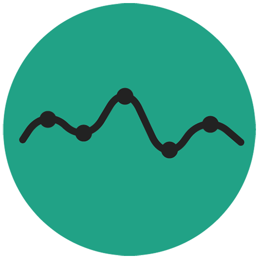

  

    
  

   
  
MyoRatio is a cutting-edge cross-platform application designed for evaluating patients with rare neuromuscular diseases. This application is the result of collaboration between the <a href="https://www.grimn.ca" style="color:#20a286;font-weight:bold">Groupe de Recherche Interdisciplinaire sur les Maladies Neuromusculaires (GRIMN)</a> and the <a href="https://liara.uqac.ca" style="color:#20a286;font-weight:bold">Laboratoire d'Intelligence Ambiante pour la Reconnaissance d'Activitées (LIARA)</a> both from the <a href="https://www.uqac.ca" style="color:#20a286;font-weight:bold">Université du Québec à Chicoutimi</a>, Canada. MyoRatio enables clinicians and researchers specializing in rare neuromuscular diseases such as DMOP, ataxia, or DM1 to precisely analyze EMG data recorded as part of rehabilitation exercises. The application provides clear insights into disease progression, assisting experts in making informed decisions. Download MyoRatio to access a specialized and innovative platform for the assessment of rare neuromuscular diseases.

   
  

    
    
  

 

### How to use the MyoRatio?

You can download the user guide manual available both in english and french versions.

 

### Want to contribute improving MyoRatio?

See the public GitHub repository for more information.

